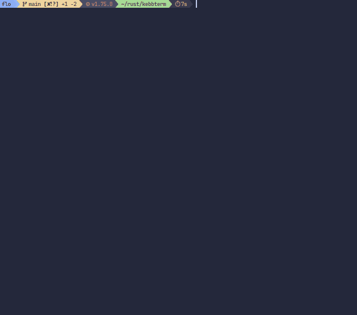

# KebbTerm

KebbTerm is a terminal game which allows you to test and improve your typing skills 🚀\
Press **ENTER/SPACE/TAB** to throw a new rocket and try to press all characters **(CTRL+C to exit)**.

<div align="center">
  
</div>

---

### Installation

KebbTerm requires [Rust](https://www.rust-lang.org/).\
In your terminal, clone this repo:

```
git clone https://github.com/flinguenheld/kebbterm
```

Move into the folder:

```
cd kebbterm
```

Launch it and have fun:

```
cargo build --release && cargo run
```

---

### Documentation

You can generate it with the command:

```
cargo doc --no-deps --open
```
